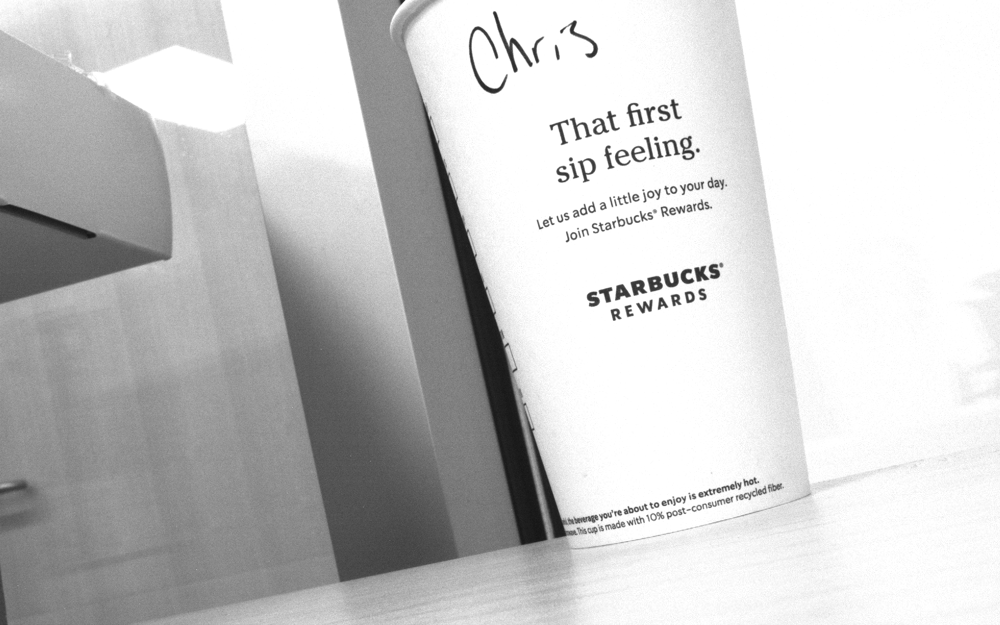

# Overcoming NSP Noise
A project aimed to overcome thermal noise generated by the heat of near sensor processing using a neural network trained on images with high amounts of thermal noise.
This project is being carried out as an independent study which has started in the spring of 2022. 

#### Collaborators
Christopher Bruinsma and Yuhao Zhu at Horizon Research, *Univerisity of Rochester*

## Capture
Images will be captured using a **FLIR BlackFly 3** camera which has thermal-noise induced using a heat gun. 
The safety of heating the camera ensured using Python code which relies on the [Spinnaker SDK](https://www.flir.com/products/spinnaker-sdk/). The camera is able to be heated up to 100°C.


This script is called ```HeatTrigger.py```, it is essentially a camera trigger that triggers based on heat. 

#### Depends on

```python
import PySpin
import sys
import time
```

#### Runs as 
```$ Python3 HeatTrigger.py```

Main additions to FLIR SDK example: ```Trigger.py``` are :

For the device temperature: ```GetCameraTemperature(cam)``` :

```python
def GetCameraTemperature(cam):
    x = 0
    if cam.DeviceTemperature.GetAccessMode() == PySpin.RO:
        x = cam.DeviceTemperature.ToString()
    x = float(x)
    return x
```
as well as:  ```Go(cam,GoalTemperature)```

```python
def Go(cam, GoalTemperature):
    # Get Temperature of Camera

    Temp = GetCameraTemperature(cam)
    print(GoalTemperature)

    # Heating
    while Temp < GoalTemperature:
        cam.Init()
        Temp = GetCameraTemperature(cam)
        print(Temp)
        time.sleep(3)  # Protects the camera.

    # Capture 2 images
    if Temp > GoalTemperature:
        # cam.DeInit() This makes the who thing crash much more quickly
        print("Capturing, please continue heating")
        Capture(cam)  # Cites : FLIR TELEDYNE
```

The heat testing is done using a loop in the ``` main()``` method. 

```python
def main():
    •••
    # List of Cameras
    for i, cam in enumerate(cam_list):
        # List of Temperatures
        for t in range(50, 80, 5):
            # Initiates Capture
            Go(cam, t)
            time.sleep(2)
    
    print("Capture Complete, please cool the camera.")
    ••• 
```
Images are saved as  ```sample-serialNumber-capNum-temp.png```

The numbering relies on the ```CamConfig.json``` which stores the number of captures after each capture. 
In the terminal it looks like the following 
```
•••
$ Acquiring images...
$ Image saved at sample-18255214-12-39.png

$ Image saved at sample-18255214-13-39.png

$ Trigger mode disabled...
•••
```


## Neural Network
Due to the nature of image processing of noisy images, max-pooling will likely be used alongside some kind of edge dectection algorthim. This aspect very much remains in the research stage, but as of right now the goal is to train a Convolution Neural Network to indentify cups of coffee that have my name on them. 

#### Runs as
```$ IgnoresThermal.py``` 

#### Intent 
Indentify cups of coffee that have my name on them. This will be done using a variety of coffee cups the on-campus Starbucks here at the Univeristy. 
These are contained withing the ```Training_Data``` folder

#### Depends on

```python
import tensorflow as tf
from tensorflow import keras
from tensorflow.keras import layers
```
As well as ```pydot``` and ```graphviz```


The data used is from the ```training_images``` folder which contains 250+ images taken by the **Blackfly** camera of a coffee cup with my name on it all taken at various temperatures ranging from 60-97°C. The former is a part of the ```YourCoffee``` data set. These images are all in the **RAW** format. The latter set of images are images that are ```NotMyCoffee``` these images are regular full color images taken with a variety of cameras and are in various image file types.


#### When Running 

Here is the test image, it is 100% my coffee 


```
(venv) chris@dhcp-10-5-48-92 CSC_Independent % Python3 ignoresthermal.py
Found 465 files belonging to 2 classes.
Using 372 files for training.
2022-02-28 22:10:32.812495: I tensorflow/core/platform/cpu_feature_guard.cc:151] 
This TensorFlow binary is optimized with oneAPI Deep Neural Network Library (oneDNN) 
to use the following CPU instructions in performance-critical operations:  AVX2 FMA
To enable them in other operations, rebuild TensorFlow with the appropriate compiler flags.
Found 465 files belonging to 2 classes.
Using 93 files for validation.
Please Enter 1 for compile 2 for test and 3 for both
1

•••
Epoch 1/50
75/75 [==============================] - 69s 882ms/step - loss: 0.5198 - accuracy: 0.7903 - val_loss: 0.4419 - val_accuracy: 0.8387
•••
Epoch 36/50
75/75 [==============================] - 71s 942ms/step - loss: 0.0949 - accuracy: 0.9704 - val_loss: 1.6228 - val_accuracy: 0.6237
•••
Epoch 45/50
75/75 [==============================] - 78s 1s/step - loss: 0.0243 - accuracy: 0.9919 - val_loss: 0.0244 - val_accuracy: 1.0000
Epoch 46/50
75/75 [==============================] - 76s 1s/step - loss: 0.1277 - accuracy: 0.9597 - val_loss: 0.0411 - val_accuracy: 0.9785
Epoch 47/50
75/75 [==============================] - 75s 1s/step - loss: 0.0803 - accuracy: 0.9812 - val_loss: 0.1400 - val_accuracy: 0.9355
Epoch 48/50
75/75 [==============================] - 72s 961ms/step - loss: 0.0573 - accuracy: 0.9839 - val_loss: 0.0492 - val_accuracy: 0.9785
Epoch 49/50
75/75 [==============================] - 72s 957ms/step - loss: 0.1275 - accuracy: 0.9462 - val_loss: 0.1103 - val_accuracy: 0.9785
Epoch 50/50
75/75 [==============================] - 74s 983ms/step - loss: 0.0695 - accuracy: 0.9812 - val_loss: 0.0585 - val_accuracy: 0.9892
•••
```
Currently the ```val_accuracy``` and ```accuracy``` are suspiciously high with ```val_accuracy``` unchanging despite varying amounts of epochs. More training and images are likely needed. Additionally, the first image is indeed my coffee, that being said the second image is definitely not my coffee and is infact a SouthWest Boeing 737 700. *Obviously work is needed*. 


### Works Cited :
> Dynamic Temperature Management of Near-Sensor Processing for Energy-Efficient High-Fidelity 
    Imaging. Kodukula Et Al.

> Dirty Pixels: Towards End-to-End Image Processing and Perception Diamond Et. Al.

> FLIR. (n.d.). Spinnaker-SDKVersion (Trigger.py). Spinnaker SDK. Retrieved from https://www.flir.com/products/spinnaker-sdk/. 

> FLIR Integrated Imaging Solutions, Inc. (n.d.). PySpinDoc. 

> François Chollet, Team, K. (n.d.). Keras documentation: Image Classification From Scratch. Keras. Retrieved February 22, 2022, from 
   https://keras.io/examples/vision/image_classification_from_scratch/ 
