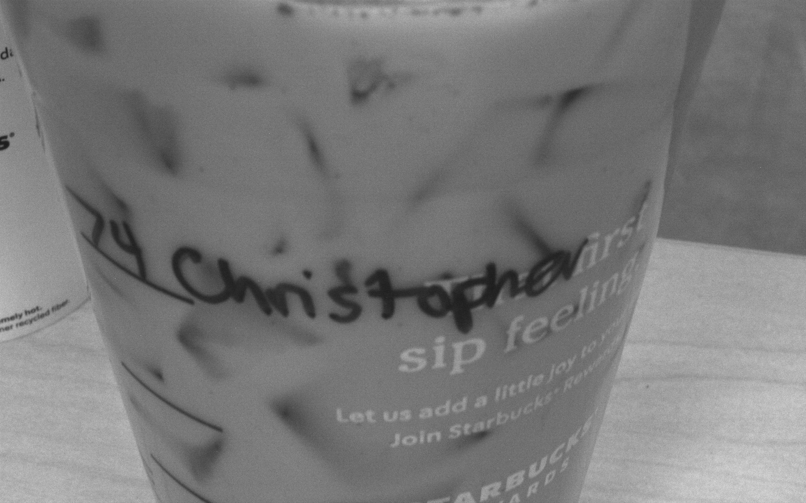
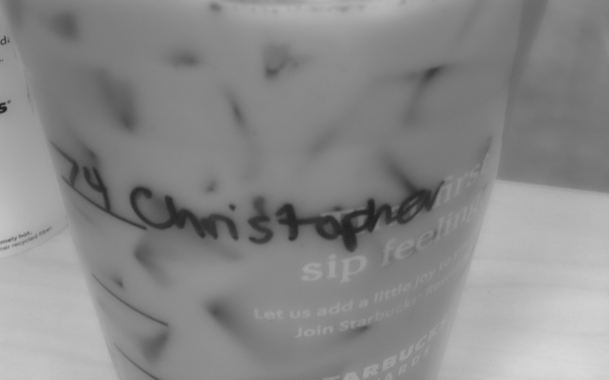

# Overcoming NSP Noise
A project aimed to overcome thermal noise generated by the heat of near sensor processing using a neural network trained on images with high amounts of thermal noise.
This project is being carried out as an independent study which has started in the Spring of 2022. 

#### Collaborators
Christopher Bruinsma and Yuhao Zhu at Horizon Research, *Univerisity of Rochester*


## Image Capture
Images will be captured using a [Flir BlackFly USB3](https://www.flir.com/products/blackfly-s-usb3/) camera which has thermal-noise induced using a heat gun from [Wagner](https://www.wagnerspraytech.com/products/heat-guns/ht400-heat-gun/). 
The safety of heating the camera ensured using Python code which relies on the [Spinnaker SDK](https://www.flir.com/products/spinnaker-sdk/) to moniter the camera temperature which is limited by the camera to less than 100°C. Having now pushed the camera to 100°C it is evident that the camera has a safety shutoff at this temperature.  

### This image was taken at 67°C


### This is that same image denoised 



This script is called ```HeatTrigger.py```, it is essentially a camera trigger that captures at a specified temperature. 

#### Depends on

```python
import PySpin
import sys
import time
```

#### Runs as 
```$ Python3 HeatTrigger.py```

<details><summary>Code Additions</summary> <p>

Main additions to FLIR SDK example: ```Trigger.py``` are :

For the device temperature: ```GetCameraTemperature(cam)``` :

```python
def GetCameraTemperature(cam):
    x = 0
    if cam.DeviceTemperature.GetAccessMode() == PySpin.RO:
        x = cam.DeviceTemperature.ToString()
    x = float(x)
    return x
```
as well as:  ```Go(cam,GoalTemperature)```

```python
def Go(cam, GoalTemperature):
    # Get Temperature of Camera

    Temp = GetCameraTemperature(cam)
    print(GoalTemperature)

    # Heating
    while Temp < GoalTemperature:
        cam.Init()
        Temp = GetCameraTemperature(cam)
        print(Temp)
        time.sleep(3)  # Protects the camera.

    # Capture 2 images
    if Temp > GoalTemperature:
        # cam.DeInit() This makes the who thing crash much more quickly
        print("Capturing, please continue heating")
        Capture(cam)  # Cites : FLIR TELEDYNE
```

The heat testing is done using a loop in the ``` main()``` method. 

```python
def main():
    •••
    # List of Cameras
    for i, cam in enumerate(cam_list):
        # List of Temperatures
        for t in range(60, 95, 1): # Capture more images per cycle
            # Initiates Capture
            Go(cam, t)
            time.sleep(2)
    
    print("Capture Complete, please cool the camera.")
    ••• 
```
</p>
</details>

Images are saved as  ```sample-serialNumber-capNum-temp.png```. These are RAW image files encoded as .png files. 

The numbering relies on the ```CamConfig.json``` which stores the number of captures after each capture. 
In the terminal it looks like the following 
```
•••
$ Acquiring images...
$ Image saved at sample-18255214-12-39.png

$ Image saved at sample-18255214-13-39.png

$ Trigger mode disabled...
•••
```


## Machine Learning
Due to the nature of image processing of noisy images, max-pooling will likely be used alongside some kind of edge dectection algorthim. This aspect very much remains in the research stage, but as of right now the goal is to train a Convolution Neural Network to indentify cups of coffee that are either hot or iced. 
This implementation relies on [TensorFlow.Keras](https://keras.io).

This machine-learning model relies heavily on ```2DConvolutions``` and ```Batch Normalizations```. However, at present it is currently not very effective, the goal now is to add more ```maxPooling``` to the model. 

#### Runs as
```$ IgnoresThermal.py``` 

#### Intent 
Indentify cups of coffee as either iced or hot. This will be done using a variety of coffee cups from the on-campus Starbucks here at the Univeristy that contain hot or iced coffee. 
These are contained within the ```Training_Data``` folder. 

#### Depends on

```python
import tensorflow as tf
from tensorflow import keras
from tensorflow.keras import layers
```
***As well as*** ```pydot``` ***and*** ```graphviz```.


The data used is from the ```training_images``` folder which contains 599+ images taken by the **Blackfly** camera of cofee cupts of iced or hot varieties taken at various temperatures ranging from 60-97°C. These images are divided into two classes ```Hot``` and ```Iced``` and futher into ```training``` and ```validation``` within their respective folders. 

#### The Code 

I have done the following to create a neural network that uses data augmentation to virtually increase the sample size, as well as varying sized 
convolution kernels, batch normalization, making more dense the layers of the network and finally dropping layers out at each iteration to help train the network of more key characteristics. 

```python 
def NModel(input_shape, num_classes):
    inputs = keras.Input(shape=input_shape)
    # Image augmentation block
    x = data_augmentation(inputs)
    x = layers.add([x, x])  # Add back residual
    x = layers.Rescaling(1.0 / 255)(x)

    # Entry block
    x = layers.Conv2D(1, 1, strides=2, padding="same")(x)
    x = layers.BatchNormalization()(x)
    x = layers.Dense(1, activation="softmax")(x)
    x = layers.add([x, x])  # Add back residual
    x = layers.Dropout(0.1)(x)

    x = layers.Conv2D(2, 1, strides=2, padding="same")(x)
    x = layers.add([x, x])  # Add back residual
    x = layers.BatchNormalization()(x)
    x = layers.Dense(1, activation="softmax")(x)
    x = layers.Dropout(0.2)(x)

    x = layers.Conv2D(4, 1, strides=2, padding="same")(x)
    x = layers.BatchNormalization()(x)
    x = layers.Dense(1, activation="softmax")(x)
    x = layers.Dropout(0.3)(x)

    x = layers.Conv2D(16, 1, strides=2, padding="same")(x)
    x = layers.BatchNormalization()(x)
    x = layers.Dense(1, activation="softmax")(x)
    x = layers.Dropout(0.4)(x)

    previous_block_activation = x  # Set aside residual

    for size in [1, 2, 4, 16]:
        x = layers.Activation("relu")(x)
        x = layers.SeparableConv2D(size, 3, padding="same")(x)
        x = layers.BatchNormalization()(x)

        x = layers.MaxPooling2D(3, strides=2, padding="same")(x)
        # Project residual
        residual = layers.Conv2D(size, 1, strides=2, padding="same")(
            previous_block_activation
        )
        x = layers.add([x, residual])  # Add back residual
        previous_block_activation = x  # Set aside next residual


    x = layers.GlobalAveragePooling2D()(x)
    x = layers.Dense(1, activation="softmax")(x)
    if num_classes == 2:
        activation = "sigmoid"
        units = 1
    else:
        activation = "softmax"
        units = num_classes

    x = layers.Dropout(0.1)(x)
    outputs = layers.Dense(units, activation=activation)(x)
    return keras.Model(inputs, outputs)
```


#### When Running 
##### Example Test
```
2022-03-03 00:26:01.678284: I tensorflow/core/platform/cpu_feature_guard.cc:151] This TensorFlow binary is optimized with oneAPI Deep Neural Network Library (oneDNN) to use the following CPU instructions in performance-critical operations:  AVX2 FMA
To enable them in other operations, rebuild TensorFlow with the appropriate compiler flags.
Found 599 files belonging to 2 classes.
Using 119 files for validation.
Please Enter 1 for compile 2 for test and 3 for both or and key to close
2
Current accuracy is 0.537177: 
You have selected test
Images of hot coffee
This image is 83.03 percent hot coffee and this image is 16.97 percent iced coffee.
This image is hot coffee

This image is 59.49 percent hot coffee and this image is 40.51 percent iced coffee.
This image is hot coffee

Images of iced coffee
This image is 16.03 percent hot coffee and this image is 83.97 percent iced coffee.
This image is cold coffee

This image is 41.25 percent hot coffee and this image is 58.75 percent iced coffee.
This image is cold coffee

Current final accuracy is 0.550496: 
```


### Analysis

#### Noisy Images
The first image is *hot coffee*, and the second image is *iced coffee*. At present, the levels of ```accuracy``` and ```val_accuracy``` are in the moderate range of *40-60*.

Clearly the classification was *incorrect* but at currently there are ```391``` images of hot coffee and ```212``` of iced coffee. Each using ```72``` and ```36``` images for validation following a *80-20* training-to-validation rule. 

When predicted, the noisy images have a lower accuracy than the denoised equivalent images. 


#### Denoised Images
These images are created by taking the RAW-encoded.png files and then denoising them using ```Adobe Lightroom```


### **Works Cited** :
> Dynamic Temperature Management of Near-Sensor Processing for Energy-Efficient High-Fidelity 
    Imaging. Kodukula Et Al.

> Dirty Pixels: Towards End-to-End Image Processing and Perception Diamond Et. Al.

> FLIR. (n.d.). Spinnaker-SDKVersion (Trigger.py). Spinnaker SDK. Retrieved from https://www.flir.com/products/spinnaker-sdk/. 

> FLIR Integrated Imaging Solutions, Inc. (n.d.). PySpinDoc. 

> François Chollet, Team, K. (n.d.). Keras documentation: Image Classification From Scratch. Keras. Retrieved February 22, 2022, from 
   https://keras.io/examples/vision/image_classification_from_scratch/ 
